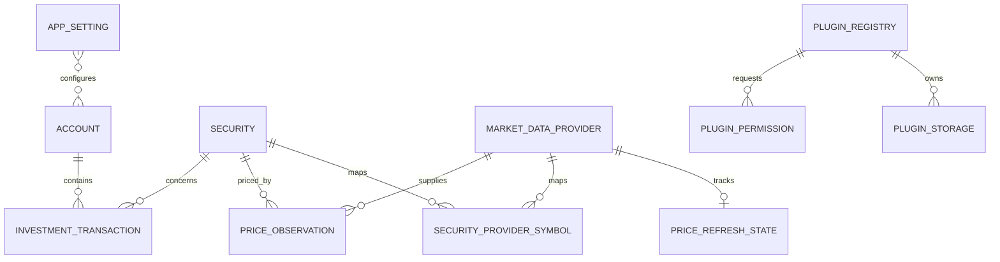

# Database Architecture

## Purpose and Boundaries

This document defines the persistent data model for Folio Evaporator's initial release. The application runs as a single-user Home Assistant add-on and stores its database at `/data/folio.db`. SQLite is the only required database service.

The database stores user-entered investment activity, instrument metadata, market-data provider metadata, observed market prices, non-secret application preferences, and plugin registry/permission state. Holdings, cost basis estimates, allocation, and portfolio value are derived by backend services from this source data; they are not editable stored balances. The browser and in-process plugins never connect to SQLite directly.

Brokerage synchronization, orders, tax-lot accounting, multi-user authorization, and automatic currency conversion are outside the initial schema.

## Design Principles

- Treat investment transactions as the source-of-truth ledger. Do not persist a mutable share balance.
- Use foreign keys and atomic transactions for writes. Enable `PRAGMA foreign_keys = ON` on every connection.
- Persist quantities and monetary values as scaled integers, not SQLite `REAL` values. This avoids binary floating-point drift.
- Store `trade_date` as a UTC ISO-8601 datetime string with fixed precision (`YYYY-MM-DDTHH:MM:SS.ffffffZ`) so lexical and chronological ordering agree. Normalize supplied offsets to UTC and reject ambiguous timestamps without a timezone. Store other event/audit timestamps as UTC ISO-8601 text with a `Z` suffix.
- Keep the security's quote currency explicit. Cross-currency totals are not calculated until a conversion source and policy are designed.
- Retain the last successful price when a refresh fails. Price observations are historical records, not a replace-in-place current-price field.
- Keep provider credentials out of application tables. Configure them through protected Home Assistant add-on options; never include them in query results or logs.
- Preserve historical prices at progressively lower sampling frequencies as they age; label retained intervals so charts and reports do not imply unavailable precision.

## Entity Relationships



`APP_SETTING` is a key/value table and has no account relationship in the initial single-user release. The last relationship is shown only to emphasize that settings are application-wide.

## Tables

### `account`

One user-defined portfolio grouping, such as a taxable account, retirement account, or watchlist.

| Column | Type | Rules and meaning |
| --- | --- | --- |
| `id` | `INTEGER` | Primary key. |
| `name` | `TEXT` | Required, trimmed, non-empty display name. |
| `account_type` | `TEXT` | Required category, initially `taxable`, `retirement`, `watchlist`, or `other`. |
| `notes` | `TEXT` | Optional user note. |
| `is_active` | `INTEGER` | Required boolean, default `1`; inactive accounts remain in historical reports. |
| `created_at` | `TEXT` | Required UTC timestamp. |
| `updated_at` | `TEXT` | Required UTC timestamp, refreshed on edits. |

Account names need not be globally unique. Deleting an account with transactions is restricted; archive it by setting `is_active = 0`.

### `market_data_provider`

One supported market-data provider known to the application. A stable provider ID is used by observations, symbol mappings, refresh state, and adapter code. Store descriptive and non-secret configuration only; API keys remain in protected Home Assistant add-on options.

| Column | Type | Rules and meaning |
| --- | --- | --- |
| `provider_id` | `TEXT` | Primary key and stable adapter identifier, for example `example_quotes`. |
| `display_name` | `TEXT` | Required UI name. |
| `website_url` | `TEXT` | Optional provider homepage. |
| `terms_url` | `TEXT` | Optional terms/licensing reference. |
| `attribution_text` | `TEXT` | Optional attribution required when displaying provider data. |
| `requires_api_key` | `INTEGER` | Required boolean, default `0`; describes configuration requirements, never stores the key. |
| `minimum_refresh_seconds` | `INTEGER` | Optional provider-request limit used to prevent excessive refreshes. |
| `is_enabled` | `INTEGER` | Required boolean, default `1`. |
| `created_at` | `TEXT` | Required UTC timestamp. |
| `updated_at` | `TEXT` | Required UTC timestamp. |

Provider adapter implementation, endpoint definitions, and capabilities remain code-owned and versioned with the application. Persist a row when a provider is first configured or encountered; retain disabled providers while observations reference them so historical provenance remains intact.

### `security`

An investment instrument. Symbol alone is not a reliable identity because symbols can overlap across exchanges.

| Column | Type | Rules and meaning |
| --- | --- | --- |
| `id` | `INTEGER` | Primary key. |
| `symbol` | `TEXT` | Required normalized ticker/symbol. |
| `isin` | `TEXT` | Optional ISO 6166 identifier, stored uppercase as 12 alphanumeric characters. Validate its checksum in the application. |
| `exchange` | `TEXT` | Optional exchange or market identifier. |
| `name` | `TEXT` | Required display name. |
| `currency` | `TEXT` | Required ISO 4217 quote currency, for example `USD`. |
| `is_active` | `INTEGER` | Required boolean, default `1`; inactive securities remain reportable historically. |
| `created_at` | `TEXT` | Required UTC timestamp. |
| `updated_at` | `TEXT` | Required UTC timestamp. |

Use a uniqueness rule for `(symbol, exchange, currency)` after normalizing case and whitespace. Because SQLite treats `NULL` values as distinct in ordinary unique indexes, either normalize a missing exchange to an empty string or use a unique expression index such as `COALESCE(exchange, '')`. ISIN, when present, must be unique across securities.

### `security_provider_symbol`

Maps an application security to the provider's instrument identifier. This is separate from `security` because the same security can have different symbols or identifiers at different providers.

| Column | Type | Rules and meaning |
| --- | --- | --- |
| `security_id` | `INTEGER` | Required FK to `security(id)`. |
| `provider_id` | `TEXT` | Required FK to `market_data_provider(provider_id)`. |
| `provider_symbol` | `TEXT` | Required symbol/identifier understood by that provider. |
| `created_at` | `TEXT` | Required UTC timestamp. |
| `updated_at` | `TEXT` | Required UTC timestamp. |

Use `(security_id, provider_id)` as the primary key. A missing mapping means that security is not available from that provider; never silently send the app's ticker as a provider identifier unless the adapter explicitly defines that fallback.

### `investment_transaction`

An immutable economic event associated with one account and security. The initial event types are `buy`, `sell`, `dividend`, and `split`. Quantity, price, and cash fields are positive magnitudes; event type determines their effect. A sale does not store a negative quantity.

| Column | Type | Rules and meaning |
| --- | --- | --- |
| `id` | `INTEGER` | Primary key. |
| `account_id` | `INTEGER` | Required FK to `account(id)`, delete restricted. |
| `security_id` | `INTEGER` | Required FK to `security(id)`, delete restricted. |
| `event_type` | `TEXT` | Required enum: `buy`, `sell`, `dividend`, or `split`. |
| `trade_date` | `TEXT` | Required UTC datetime when the event applies, formatted `YYYY-MM-DDTHH:MM:SS.ffffffZ` with exactly six fractional-second digits. |
| `quantity_atoms` | `INTEGER` | Positive share quantity in atoms for `buy`/`sell`; null for `dividend`/`split`. One share is `100000000` atoms. |
| `unit_price_atoms` | `INTEGER` | Positive quote-currency price per share in 1e-8 currency units for `buy`/`sell`; null otherwise. |
| `fees_atoms` | `INTEGER` | Non-negative quote-currency amount in 1e-8 currency units for `buy`/`sell`; zero by default. |
| `cash_amount_atoms` | `INTEGER` | Positive dividend amount in 1e-8 currency units for `dividend`; null otherwise. |
| `split_numerator` | `INTEGER` | Positive new-share numerator for `split`; null otherwise. |
| `split_denominator` | `INTEGER` | Positive old-share denominator for `split`; null otherwise. |
| `note` | `TEXT` | Optional user note. |
| `created_at` | `TEXT` | Required UTC insertion timestamp. |
| `reverses_transaction_id` | `INTEGER` | Optional self-FK used to represent a correction or reversal without erasing its history. |
| `supersedes_transaction_id` | `INTEGER` | Optional self-FK from a replacement event to the event it corrects. |

All monetary atom columns use the same 1e-8 scale, independent of the currency's display precision. Round only at defined calculation/display boundaries and use integer or decimal arithmetic in the domain layer. Check multiplication and aggregation for 64-bit integer overflow; if the supported range becomes insufficient, migrate to canonical decimal text and decimal arithmetic rather than `REAL`.

The API must enforce event-specific field combinations: buys/sells require positive quantity and unit price and non-negative fees; dividends require a positive cash amount; splits require a positive ratio. Other event-specific fields must be null. Enforce these rules in both request validation and SQL `CHECK` constraints where practical. A split ratio of `2/1` means each old share becomes two shares. Splits change derived share quantity but do not add economic value.

**Edit and correction policy:** posted events are immutable; `created_at` records when each event was entered. The UI may offer editing, but persist the change as a reversal linked through `reverses_transaction_id` followed by a replacement event linked through `supersedes_transaction_id`, in one database transaction. A reversal has the same event type and magnitudes as its target, but negates that target's ledger effect. Allow at most one reversal and one direct replacement per event. The application validates that links point to compatible events and do not form cycles. This keeps recalculation and audit history deterministic.

**Cost basis policy:** derive an informational weighted-average cost estimate from buy/sell history and fees. It is not tax-lot accounting, tax advice, or a tax-reporting value. Dividends are stored as income events, not added to share quantity. The initial schema does not maintain a cash balance.

### `price_observation`

One market-data observation for one security from one provider. Keep recent observations relatively dense and progressively reduce the sampling frequency for older history. Retained points are actual provider observations, not interpolated prices.

| Column | Type | Rules and meaning |
| --- | --- | --- |
| `id` | `INTEGER` | Primary key. |
| `security_id` | `INTEGER` | Required FK to `security(id)`, delete restricted. |
| `provider_id` | `TEXT` | Required FK to `market_data_provider(provider_id)`. |
| `observed_at` | `TEXT` | Required UTC time the quote represents, not the time it was fetched. |
| `fetched_at` | `TEXT` | Required UTC time the application received the quote. |
| `price_atoms` | `INTEGER` | Required non-negative quote price in 1e-8 units of `currency`. |
| `currency` | `TEXT` | Required ISO 4217 currency returned with this observation. |
| `history_interval` | `TEXT` | Required retention sampling tier: `intraday`, `daily`, `weekly`, `monthly`, or `yearly`. |

Use a unique constraint on `(security_id, provider_id, observed_at)` so retries can upsert the same observation. Do not overwrite earlier observations with later quotes. For valuation, choose the newest observation for the configured provider whose `observed_at` is not later than the valuation time. Expose `observed_at`, `history_interval`, and quote age in the API/UI so stale or coarse data is visible.

#### Historical Sampling and Retention

Use a configurable, age-based compaction policy. Initial defaults:

| Observation age | Maximum retained density | `history_interval` |
| --- | --- | --- |
| 0–90 days | Configured intraday cadence when enabled; otherwise one observation per UTC calendar day | `intraday` or `daily` |
| 91 days–2 years | One observation per UTC calendar week | `weekly` |
| 2–10 years | One observation per UTC calendar month | `monthly` |
| More than 10 years | One observation per UTC calendar year | `yearly` |

When compacting a bucket, retain its latest actual observation; keep the newest observation for each security/provider regardless of age. Delete redundant older points only inside a successful database transaction, and update the retained point's `history_interval` to the applicable tier. Do not synthesize/interpolate values. Run compaction after successful history ingestion and periodically, not on each dashboard request. Store policy values as non-secret `app_setting` entries so defaults can evolve without changing the quote schema.

This policy deliberately makes old as-of valuations less precise. Use the nearest preceding retained observation and return its timestamp and interval; never present a monthly/yearly point as a daily quote. Keep bucket boundaries deterministic in UTC and include the chosen interval in chart metadata. Price history remains bounded to a small number of points per security while preserving long-term trend context.

### `app_setting`

Small application-wide non-secret preferences, stored as key/value text.

| Column | Type | Rules and meaning |
| --- | --- | --- |
| `key` | `TEXT` | Primary key. Stable setting name. |
| `value` | `TEXT` | Required value; parse and validate according to the setting definition. |
| `updated_at` | `TEXT` | Required UTC timestamp. |

Examples include refresh interval, selected provider ID, and price-retention days. Do not store provider tokens, Home Assistant credentials, or other secrets here. The add-on options are the source for secret configuration; at runtime secrets should be held only as long as required to make provider requests.

### `price_refresh_state`

The most recent refresh status per provider, allowing the UI to distinguish stale data from a refresh that has never succeeded.

| Column | Type | Rules and meaning |
| --- | --- | --- |
| `provider_id` | `TEXT` | Primary key and FK to `market_data_provider(provider_id)`. |
| `last_attempt_at` | `TEXT` | Optional UTC timestamp of the last attempt. |
| `last_success_at` | `TEXT` | Optional UTC timestamp of the last fully or partially successful refresh. |
| `status` | `TEXT` | Required status such as `never`, `success`, `partial`, or `failed`. |
| `error_summary` | `TEXT` | Optional sanitized, user-safe summary; never include tokens or sensitive response bodies. |
| `updated_at` | `TEXT` | Required UTC update timestamp. |

This state is operational metadata, not a replacement for quote timestamps on `price_observation`.

### Plugin access tables

The core service uses these tables to persist installed plugin registration and user-approved permission scopes. Plugins run in the core process; permission state controls capabilities exposed by the plugin host, but does not provide operating-system isolation. See [core service architecture](core-service.md) for plugin lifecycle and scope enforcement.

#### `plugin_registry`

| Column | Type | Rules and meaning |
| --- | --- | --- |
| `plugin_id` | `TEXT` | Stable namespaced primary key. |
| `display_name` | `TEXT` | Required UI name. |
| `version` | `TEXT` | Required installed plugin version. |
| `api_version` | `TEXT` | Required plugin API version supported by this plugin. |
| `status` | `TEXT` | `enabled`, `disabled`, or `removed`; only enabled plugins are loaded. Removed registrations remain as tombstones while plugin data is retained. |
| `registered_at` | `TEXT` | Required UTC timestamp. |
| `updated_at` | `TEXT` | Required UTC timestamp. |

#### `plugin_permission`

One row per requested scope. A permission is effective only if `granted_at` is present and `revoked_at` is null, and the scope remains requested by the current plugin manifest.

| Column | Type | Rules and meaning |
| --- | --- | --- |
| `plugin_id` | `TEXT` | Required FK to `plugin_registry(plugin_id)`. |
| `permission` | `TEXT` | Required core-defined scope identifier. |
| `requested_at` | `TEXT` | Required UTC timestamp when requested by the manifest. |
| `granted_at` | `TEXT` | Optional UTC user approval time. |
| `revoked_at` | `TEXT` | Optional UTC revocation time. |

#### `plugin_storage`

Persistent key/value data owned by one plugin. The host exposes this through a namespaced storage API; a plugin can read or write only its own keys. Validate values as bounded JSON and enforce per-plugin size limits. Keep rows when a plugin is removed, and delete them only through the user's explicit purge action.

| Column | Type | Rules and meaning |
| --- | --- | --- |
| `plugin_id` | `TEXT` | Required FK to `plugin_registry(plugin_id)`, delete restricted so retained data cannot be orphaned accidentally. |
| `key` | `TEXT` | Required non-empty plugin-local key. |
| `value_json` | `TEXT` | Required bounded JSON value, validated by the application. |
| `updated_at` | `TEXT` | Required UTC timestamp. |

Use `(plugin_id, key)` as the primary key. Purging plugin data deletes its rows and may then delete the removed registry tombstone if no other references remain.

## Proposed SQLite DDL

This is a logical starting schema. Implementations should add explicit `NOT NULL`, `CHECK`, and event-shape constraints described above, and include each schema change in a migration.

```sql
CREATE TABLE account (
    id INTEGER PRIMARY KEY,
    name TEXT NOT NULL CHECK (length(trim(name)) > 0),
    account_type TEXT NOT NULL CHECK (account_type IN ('taxable', 'retirement', 'watchlist', 'other')),
    notes TEXT,
    is_active INTEGER NOT NULL DEFAULT 1 CHECK (is_active IN (0, 1)),
    created_at TEXT NOT NULL,
    updated_at TEXT NOT NULL
);

CREATE TABLE market_data_provider (
    provider_id TEXT PRIMARY KEY,
    display_name TEXT NOT NULL CHECK (length(trim(display_name)) > 0),
    website_url TEXT,
    terms_url TEXT,
    attribution_text TEXT,
    requires_api_key INTEGER NOT NULL DEFAULT 0 CHECK (requires_api_key IN (0, 1)),
    minimum_refresh_seconds INTEGER CHECK (minimum_refresh_seconds IS NULL OR minimum_refresh_seconds > 0),
    is_enabled INTEGER NOT NULL DEFAULT 1 CHECK (is_enabled IN (0, 1)),
    created_at TEXT NOT NULL,
    updated_at TEXT NOT NULL
);

CREATE TABLE security (
    id INTEGER PRIMARY KEY,
    symbol TEXT NOT NULL CHECK (length(trim(symbol)) > 0),
    isin TEXT CHECK (isin IS NULL OR (length(isin) = 12 AND isin = upper(isin)
        AND isin NOT GLOB '*[^A-Z0-9]*')),
    exchange TEXT,
    name TEXT NOT NULL CHECK (length(trim(name)) > 0),
    currency TEXT NOT NULL CHECK (length(currency) = 3),
    is_active INTEGER NOT NULL DEFAULT 1 CHECK (is_active IN (0, 1)),
    created_at TEXT NOT NULL,
    updated_at TEXT NOT NULL
);

CREATE UNIQUE INDEX uq_security_identity
    ON security(lower(trim(symbol)), COALESCE(lower(trim(exchange)), ''), upper(currency));
CREATE UNIQUE INDEX uq_security_isin
    ON security(isin)
    WHERE isin IS NOT NULL;

CREATE TABLE security_provider_symbol (
    security_id INTEGER NOT NULL REFERENCES security(id) ON DELETE RESTRICT,
    provider_id TEXT NOT NULL REFERENCES market_data_provider(provider_id) ON DELETE RESTRICT,
    provider_symbol TEXT NOT NULL CHECK (length(trim(provider_symbol)) > 0),
    created_at TEXT NOT NULL,
    updated_at TEXT NOT NULL,
    PRIMARY KEY (security_id, provider_id)
);

CREATE TABLE investment_transaction (
    id INTEGER PRIMARY KEY,
    account_id INTEGER NOT NULL REFERENCES account(id) ON DELETE RESTRICT,
    security_id INTEGER NOT NULL REFERENCES security(id) ON DELETE RESTRICT,
    event_type TEXT NOT NULL CHECK (event_type IN ('buy', 'sell', 'dividend', 'split')),
    trade_date TEXT NOT NULL,
    quantity_atoms INTEGER,
    unit_price_atoms INTEGER,
    fees_atoms INTEGER NOT NULL DEFAULT 0,
    cash_amount_atoms INTEGER,
    split_numerator INTEGER,
    split_denominator INTEGER,
    note TEXT,
    created_at TEXT NOT NULL,
    reverses_transaction_id INTEGER REFERENCES investment_transaction(id) ON DELETE RESTRICT,
    supersedes_transaction_id INTEGER REFERENCES investment_transaction(id) ON DELETE RESTRICT,
    CHECK (fees_atoms >= 0),
    CHECK (
        (event_type IN ('buy', 'sell') AND quantity_atoms IS NOT NULL AND quantity_atoms > 0
            AND unit_price_atoms IS NOT NULL AND unit_price_atoms > 0
            AND cash_amount_atoms IS NULL AND split_numerator IS NULL AND split_denominator IS NULL)
        OR (event_type = 'dividend' AND quantity_atoms IS NULL AND unit_price_atoms IS NULL
            AND cash_amount_atoms IS NOT NULL AND cash_amount_atoms > 0
            AND split_numerator IS NULL AND split_denominator IS NULL
            AND fees_atoms = 0)
        OR (event_type = 'split' AND quantity_atoms IS NULL AND unit_price_atoms IS NULL
            AND cash_amount_atoms IS NULL AND split_numerator IS NOT NULL AND split_numerator > 0
            AND split_denominator IS NOT NULL AND split_denominator > 0
            AND fees_atoms = 0)
    )
);

CREATE UNIQUE INDEX uq_transaction_reversal
    ON investment_transaction(reverses_transaction_id)
    WHERE reverses_transaction_id IS NOT NULL;
CREATE UNIQUE INDEX uq_transaction_superseded_event
    ON investment_transaction(supersedes_transaction_id)
    WHERE supersedes_transaction_id IS NOT NULL;

CREATE TABLE price_observation (
    id INTEGER PRIMARY KEY,
    security_id INTEGER NOT NULL REFERENCES security(id) ON DELETE RESTRICT,
    provider_id TEXT NOT NULL REFERENCES market_data_provider(provider_id) ON DELETE RESTRICT,
    observed_at TEXT NOT NULL,
    fetched_at TEXT NOT NULL,
    price_atoms INTEGER NOT NULL CHECK (price_atoms >= 0),
    currency TEXT NOT NULL CHECK (length(currency) = 3),
    history_interval TEXT NOT NULL CHECK (history_interval IN ('intraday', 'daily', 'weekly', 'monthly', 'yearly')),
    UNIQUE (security_id, provider_id, observed_at)
);

CREATE TABLE app_setting (
    key TEXT PRIMARY KEY,
    value TEXT NOT NULL,
    updated_at TEXT NOT NULL
);

CREATE TABLE price_refresh_state (
    provider_id TEXT PRIMARY KEY REFERENCES market_data_provider(provider_id) ON DELETE RESTRICT,
    last_attempt_at TEXT,
    last_success_at TEXT,
    status TEXT NOT NULL CHECK (status IN ('never', 'success', 'partial', 'failed')),
    error_summary TEXT,
    updated_at TEXT NOT NULL
);

CREATE TABLE schema_migration (
    version INTEGER PRIMARY KEY,
    applied_at TEXT NOT NULL
);

CREATE TABLE plugin_registry (
    plugin_id TEXT PRIMARY KEY,
    display_name TEXT NOT NULL CHECK (length(trim(display_name)) > 0),
    version TEXT NOT NULL,
    api_version TEXT NOT NULL,
    status TEXT NOT NULL CHECK (status IN ('enabled', 'disabled', 'removed')),
    registered_at TEXT NOT NULL,
    updated_at TEXT NOT NULL
);

CREATE TABLE plugin_permission (
    plugin_id TEXT NOT NULL REFERENCES plugin_registry(plugin_id) ON DELETE CASCADE,
    permission TEXT NOT NULL,
    requested_at TEXT NOT NULL,
    granted_at TEXT,
    revoked_at TEXT,
    PRIMARY KEY (plugin_id, permission),
    CHECK (revoked_at IS NULL OR granted_at IS NOT NULL)
);

CREATE TABLE plugin_storage (
    plugin_id TEXT NOT NULL REFERENCES plugin_registry(plugin_id) ON DELETE RESTRICT,
    key TEXT NOT NULL CHECK (length(trim(key)) > 0),
    value_json TEXT NOT NULL,
    updated_at TEXT NOT NULL,
    PRIMARY KEY (plugin_id, key)
);

```

The DDL intentionally does not try to encode all chronological portfolio rules. In particular, the application must validate that a sale does not make a position negative unless short positions are explicitly supported, and that corrections reverse a compatible prior event. Date format validity and timestamp normalization are also checked at the API/storage boundary.

## Derived Data and Query Rules

- **Position quantity:** process events for an account/security in `trade_date` timestamp order and stable insertion order (`id`) for ties. Buys increase shares, sells decrease shares, splits multiply shares by their ratio, dividends do not change shares, and reversal events negate the referenced event's effect. Reject unsupported negative balances.
- **Cost basis estimate:** derive from the same ordered event stream using the documented weighted-average policy. Define fee treatment and split rounding in the domain layer and cover them with tests. Do not present it as tax-lot basis.
- **Market value:** position quantity multiplied by the latest eligible price observation. Do not combine values in different currencies; show per-currency totals until conversion is supported.
- **Performance:** report the calculation method and available history. Do not describe a simple change in market value as investment return where external cash flows are not modeled.
- **Current holdings and dashboard totals:** calculate from ledger and price observations, or add rebuildable caches only after measuring a performance need. Any cache must be disposable and reproducible from source tables.

## Indexes

Create indexes for the main access paths:

```sql
CREATE INDEX ix_transaction_account_date
    ON investment_transaction(account_id, trade_date, id);
CREATE INDEX ix_transaction_security_date
    ON investment_transaction(security_id, trade_date, id);
CREATE INDEX ix_provider_symbol_lookup
    ON security_provider_symbol(provider_id, provider_symbol);
CREATE INDEX ix_price_latest
    ON price_observation(security_id, provider_id, observed_at DESC);
```

The unique index on `price_observation` already supports the corresponding prefix lookup. Keep indexes tied to measured query needs; SQLite does not require a separate index for every foreign key, but these transaction indexes also support account/security history views.

## Atomicity, Migrations, and Backups

- Insert an event and any correction/reversal records in a single database transaction. Commit only after all validation succeeds.
- Use a migration table such as `schema_migration(version, applied_at)` and apply ordered, transactional migrations at startup before serving requests. Never silently recreate or truncate a database after a migration failure.
- Run integrity checks as an explicit diagnostic or after restore, not as a destructive automatic repair. Surface database errors in add-on logs and preserve the original database for recovery.
- Back up the database through the Home Assistant add-on backup mechanism or SQLite's online backup API. Do not copy the live database file while writes may be in progress.
- Retain migration compatibility and test backup/restore across supported add-on upgrades. Keep the database under `/data` so it survives container replacement.

## Initial Acceptance Checks

1. A buy, sell, split, dividend, and correction produce the expected derived holdings and weighted-average cost estimate.
2. Invalid event field combinations, unknown foreign keys, duplicate symbol identities or ISINs, and unsupported negative holdings are rejected.
3. A price refresh upserts a repeated observation without duplicating it, retains older history, and leaves the last good observation available after provider failure.
4. Timestamps, currency fields, fixed-point boundaries, plugin permissions, migrations, and a Home Assistant backup/restore round trip are covered by tests.
